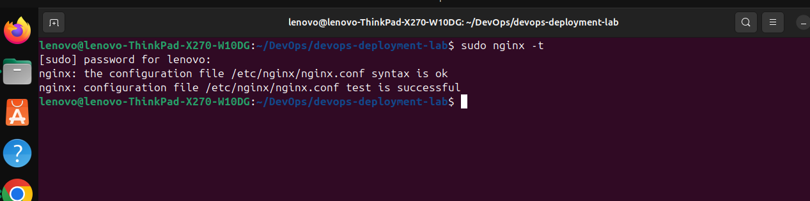
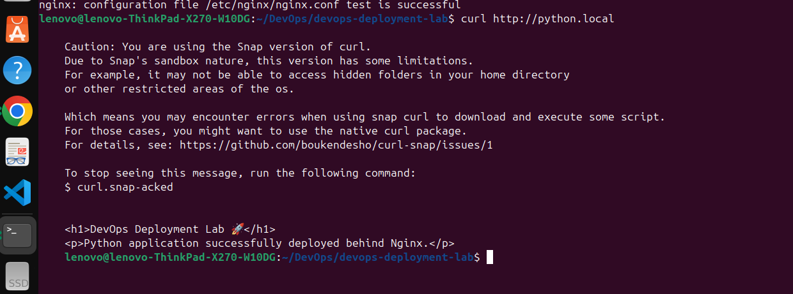

# 🐍 Python Application Deployment with Nginx

> **DevOps Deployment Lab — Task 01**


---

## 🎯 Objective

The objective of this task was to deploy a **Python Flask application behind Nginx**.

The Flask application runs locally on port `5000`, while Nginx listens for incoming HTTP requests on port `80` and forwards those requests to the Flask application.

This demonstrates the basic concept of using **Nginx as a reverse proxy** for a backend application.

---

## 🏗️ Architecture

The deployment follows this request flow:

```text
                    Client
                  Browser / curl
                       │
                       │ HTTP
                       │ Port 80
                       ▼
              ┌─────────────────┐
              │      NGINX      │
              │    Port 80      │
              │ Reverse Proxy   │
              └────────┬────────┘
                       │
                       │ proxy_pass
                       │
                       ▼
              ┌─────────────────┐
              │  Flask App      │
              │ Python          │
              │ 127.0.0.1:5000  │
              └─────────────────┘
```

### Request Flow

```text
http://python.local
        │
        ▼
    Nginx :80
        │
        │ proxy_pass
        ▼
 Flask :5000
        │
        ▼
    HTTP Response
```

The client does **not directly access Flask on port 5000** when using the Nginx configuration.

Instead:

**Client → Nginx → Flask → Nginx → Client**

---

## 🛠️ Technologies Used

| Technology   | Purpose                       |
| ------------ | ----------------------------- |
| Ubuntu Linux | Operating system              |
| Python       | Application runtime           |
| Flask        | Python web framework          |
| Nginx        | Web server and reverse proxy  |
| curl         | Application testing           |
| Git          | Version control               |
| GitHub       | Source code and documentation |

---

## 📁 Project Structure

```text
01-python-nginx/
│
├── README.md
│
├── app/
│   ├── app.py
│   └── requirements.txt
│
├── nginx/
│   └── python-app.conf
│
└── screenshots/
    ├── flask-running.png
    ├── nginx-test.png
    ├── python-local.png
    └── health-check.png
```

---

# 🚀 Deployment

## 1. Create the Python Application

The Flask application is located inside:

```text
app/app.py
```

The application contains two endpoints:

```text
/
```

and

```text
/health
```

The root endpoint displays the application page, while `/health` provides a simple health check.

---

## 2. Python Application

```python
from flask import Flask

app = Flask(__name__)

@app.route("/")
def home():
    return """
    <h1>DevOps Deployment Lab 🚀</h1>
    <p>Python application successfully deployed behind Nginx.</p>
    """

@app.route("/health")
def health():
    return {
        "status": "healthy",
        "service": "python-flask"
    }

if __name__ == "__main__":
    app.run(host="127.0.0.1", port=5000)
```

### Important Configuration

```python
app.run(host="127.0.0.1", port=5000)
```

This starts the Flask application on:

```text
127.0.0.1:5000
```

### What does this mean?

* `127.0.0.1` → localhost, meaning the application is running on this machine.
* `5000` → the port on which Flask listens for requests.

Therefore:

```text
Flask → 127.0.0.1:5000
```

---

# 🐍 3. Create a Python Virtual Environment

Navigate to the application directory:

```bash
cd ~/DevOps/devops-deployment-lab/01-python-nginx/app
```

Create the virtual environment:

```bash
python3 -m venv venv
```

### What does this command do?

`python3` runs Python 3.

`-m venv` tells Python to use its built-in virtual environment module.

`venv` is the name of the environment.

The virtual environment isolates the application's Python dependencies from the system Python installation.

---

## 4. Activate the Virtual Environment

```bash
source venv/bin/activate
```

After activation, the terminal normally shows something similar to:

```text
(venv) user@machine:~/...
```

This indicates that commands such as `python` and `pip` are using the virtual environment.

---

## 5. Install Dependencies

The required packages are listed in:

```text
requirements.txt
```

Install them using:

```bash
pip install -r requirements.txt
```

### What does this command do?

`pip` is Python's package manager.

The `-r` option tells pip to read package requirements from a file.

Therefore:

```bash
pip install -r requirements.txt
```

installs all dependencies required by the application.

---

# ▶️ 6. Start the Flask Application

Run:

```bash
python app.py
```

Flask starts on:

```text
http://127.0.0.1:5000
```

### Expected Result

```text
Running on http://127.0.0.1:5000
```

📸 **Screenshot:**

Save a screenshot showing the Flask application running as:

```text
screenshots/flask-running.png
```

---

# 🧪 7. Test Flask Directly

Before configuring Nginx, the backend application should be tested independently.

Run:

```bash
curl http://127.0.0.1:5000
```

Expected response:

```html
<h1>DevOps Deployment Lab 🚀</h1>
<p>Python application successfully deployed behind Nginx.</p>
```

This confirms that Flask itself is working.

---

## Health Check

Run:

```bash
curl http://127.0.0.1:5000/health
```

Expected response:

```json
{
    "service": "python-flask",
    "status": "healthy"
}
```

At this point:

```text
Client → Flask :5000
```

works successfully.

---

# 🌐 8. Configure Nginx

Create the Nginx configuration:

```text
/etc/nginx/sites-available/python-app
```

Configuration:

```nginx
server {
    listen 80;
    server_name python.local;

    location / {
        proxy_pass http://127.0.0.1:5000;

        proxy_set_header Host $host;
        proxy_set_header X-Real-IP $remote_addr;
        proxy_set_header X-Forwarded-For $proxy_add_x_forwarded_for;
        proxy_set_header X-Forwarded-Proto $scheme;
    }
}
```

A copy of this configuration is also stored in this repository:

```text
nginx/python-app.conf
```

---

# 🔍 9. Understanding the Nginx Configuration

## `listen 80`

```nginx
listen 80;
```

This tells Nginx to listen for HTTP traffic on port `80`.

Therefore:

```text
Client
   │
   │ HTTP :80
   ▼
 Nginx
```

---

## `server_name`

```nginx
server_name python.local;
```

This tells Nginx that this server block should handle requests made to:

```text
python.local
```

The local domain is mapped to the machine through `/etc/hosts`.

Example:

```text
127.0.0.1 python.local
```

---

## `location /`

```nginx
location / {
```

This tells Nginx that requests matching `/` and its paths should be handled by this location block.

For example:

```text
/
 /health
 /about
```

---

## `proxy_pass`

```nginx
proxy_pass http://127.0.0.1:5000;
```

This is the most important part.

It tells Nginx:

> Forward incoming requests to the Flask application running on port 5000.

Therefore:

```text
Client
   │
   │ :80
   ▼
 Nginx
   │
   │ proxy_pass
   ▼
Flask
 :5000
```

Nginx is acting as a **reverse proxy**.

---

# 📦 10. Proxy Headers

The configuration contains:

```nginx
proxy_set_header Host $host;
```

Passes the original hostname requested by the client to Flask.

---

```nginx
proxy_set_header X-Real-IP $remote_addr;
```

Passes the client's IP address to the backend.

---

```nginx
proxy_set_header X-Forwarded-For $proxy_add_x_forwarded_for;
```

Maintains the chain of client/proxy IP addresses.

---

```nginx
proxy_set_header X-Forwarded-Proto $scheme;
```

Tells the backend whether the original request used HTTP or HTTPS.

These headers are useful because the backend application otherwise sees the request as coming from Nginx rather than directly from the original client.

---

# 🔗 11. Enable the Nginx Site

Create a symbolic link:

```bash
sudo ln -s /etc/nginx/sites-available/python-app /etc/nginx/sites-enabled/python-app
```

The purpose of this structure is:

```text
sites-available/
        │
        │ configuration files
        │
        ▼
sites-enabled/
        │
        │ enabled configurations
        ▼
      Nginx
```

If the symbolic link already exists, there is no need to create it again.

---

# 🧪 12. Test Nginx Configuration

Before reloading Nginx, test the configuration:

```bash
sudo nginx -t
```

Expected output:

```text
syntax is ok
test is successful
```

This checks whether the Nginx configuration contains valid syntax and can be loaded.

📸 **Screenshot:**

Save the terminal screenshot as:

```text
screenshots/nginx-test.png
```

---

# 🔄 13. Reload Nginx

After a successful configuration test:

```bash
sudo systemctl reload nginx
```

Reloading applies the new configuration without completely stopping the Nginx service.

---

# 🖥️ 14. Configure the Local Domain

Edit:

```bash
sudo nano /etc/hosts
```

Add:

```text
127.0.0.1 python.local
```

This tells the operating system:

> When `python.local` is requested, resolve it to this machine.

Therefore:

```text
python.local
      ↓
127.0.0.1
      ↓
Nginx :80
```

---

# ✅ 15. Test the Application Through Nginx

Now test:

```bash
curl http://python.local
```

Expected response:

```html
<h1>DevOps Deployment Lab 🚀</h1>
<p>Python application successfully deployed behind Nginx.</p>
```

This proves that:

```text
curl
  ↓
python.local
  ↓
Nginx :80
  ↓
proxy_pass
  ↓
Flask :5000
```

is working correctly.

📸 **Screenshot:**

Save the screenshot as:

```text
screenshots/python-local.png
```

---

# ❤️ 16. Test the Health Endpoint Through Nginx

Run:

```bash
curl http://python.local/health
```

Expected response:

```json
{
    "service": "python-flask",
    "status": "healthy"
}
```

This confirms that Nginx can successfully forward application routes to Flask.

📸 **Screenshot:**

Save the screenshot as:

```text
screenshots/health-check.png
```

---

# ⚠️ 17. Important Issue: `127.0.0.1` vs `python.local`

During testing, the following command:

```bash
curl http://127.0.0.1
```

returned the Nginx welcome page instead of the Flask application.

However:

```bash
curl http://python.local
```

returned the Flask application successfully.

### Why?

The Nginx configuration contains:

```nginx
server_name python.local;
```

Nginx uses the hostname from the HTTP `Host` header to select the appropriate server block.

When we run:

```bash
curl http://python.local
```

the request contains approximately:

```text
Host: python.local
```

Therefore Nginx selects:

```nginx
server_name python.local;
```

and sends the request to:

```text
127.0.0.1:5000
```

But when we run:

```bash
curl http://127.0.0.1
```

the hostname is:

```text
127.0.0.1
```

which does not match:

```text
python.local
```

Therefore Nginx can select another/default server block.

### This is not a Flask or reverse-proxy failure.

The correct test for this configuration is:

```bash
curl http://python.local
```

---

# 🔄 Complete Request Flow

The final deployment works like this:

```text
                    ┌──────────────┐
                    │    Client    │
                    │  Browser/curl│
                    └──────┬───────┘
                           │
                           │ HTTP
                           │ :80
                           ▼
                 ┌───────────────────┐
                 │       NGINX       │
                 │                   │
                 │ server_name:      │
                 │ python.local      │
                 └─────────┬─────────┘
                           │
                           │ proxy_pass
                           │
                           ▼
                 ┌───────────────────┐
                 │   Flask Backend   │
                 │                   │
                 │ 127.0.0.1:5000   │
                 └─────────┬─────────┘
                           │
                           │ Response
                           ▼
                 ┌───────────────────┐
                 │       NGINX       │
                 └─────────┬─────────┘
                           │
                           ▼
                        Client
```

---

# 🧪 Verification Checklist

| Test                       | Command                             | Result |
| -------------------------- | ----------------------------------- | ------ |
| Flask running              | `python app.py`                     | ✅      |
| Flask root endpoint        | `curl http://127.0.0.1:5000`        | ✅      |
| Flask health endpoint      | `curl http://127.0.0.1:5000/health` | ✅      |
| Nginx configuration        | `sudo nginx -t`                     | ✅      |
| Nginx reload               | `sudo systemctl reload nginx`       | ✅      |
| Local domain               | `curl http://python.local`          | ✅      |
| Nginx → Flask health check | `curl http://python.local/health`   | ✅      |

---

# 📸 Screenshots

The following screenshots document the successful deployment:

### Flask Application Running


### Nginx Configuration Test



### Python Application Through Nginx



### Health Check Through Nginx


> Add the screenshots to the `screenshots/` directory using the exact filenames above.

---

# 🧠 What I Learned

Through this task, I learned:

* How to create and use a Python virtual environment.
* How to install Python dependencies using `requirements.txt`.
* How Flask runs as a backend application.
* How applications listen on specific ports.
* How Nginx listens for HTTP traffic on port `80`.
* How Nginx uses `server_name` to select a server block.
* How Nginx works as a reverse proxy.
* How `proxy_pass` forwards requests to a backend application.
* Why proxy headers are used.
* How `/etc/hosts` provides local hostname resolution.
* How to test Nginx configuration using `nginx -t`.
* How to reload Nginx after configuration changes.
* How to troubleshoot hostname/server-block issues.
* How to verify a backend independently before testing it through a reverse proxy.

---

# 💡 Key DevOps Concept

The most important concept from this task is:

> **Nginx does not run the Python application.**

Flask runs the Python application:

```text
Flask → 127.0.0.1:5000
```

Nginx receives the client's request:

```text
Nginx → :80
```

and forwards it to Flask:

```text
Nginx → proxy_pass → Flask :5000
```

Therefore, the responsibilities are separated:

```text
                 NGINX
            Reverse Proxy
                  │
                  ▼
                FLASK
           Backend Application
```

---

# 🏁 Final Result

The Python Flask application was successfully deployed behind Nginx.

The final request flow is:

```text
http://python.local
        ↓
    Nginx :80
        ↓
 Reverse Proxy
        ↓
 Flask :5000
        ↓
 Application Response
```

### Status

**✅ Task 01 — Python Application Deployment with Nginx — COMPLETED**
