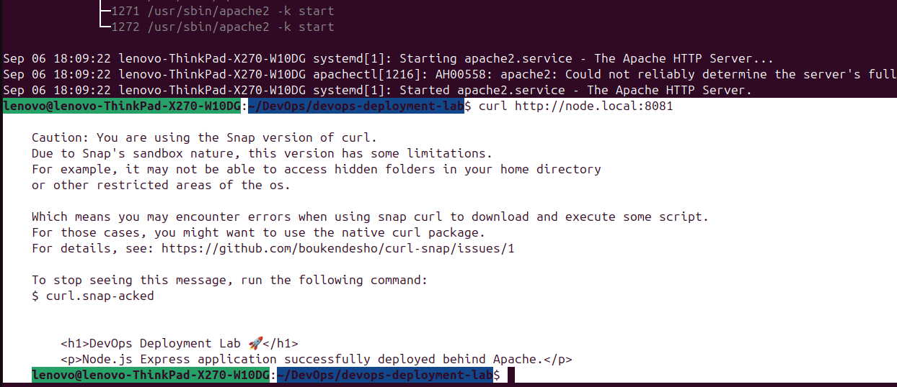

# 🟢 Node.js Express Application Deployment with Apache

> **DevOps Deployment Lab — Task 02**


---

## 🎯 Objective

The objective of this task was to deploy a **Node.js application using Express.js behind Apache HTTP Server**.

The Express application runs on port `3000`, while Apache listens for incoming HTTP requests on port `8081`.

Apache is configured as a **reverse proxy** that forwards client requests to the Node.js application.

This demonstrates how Apache can act as a front-end web server and reverse proxy for a Node.js backend application.

---

# 🏗️ Architecture

```text
                    Client
                 Browser / curl
                       │
                       │ HTTP :8081
                       ▼
              ┌─────────────────┐
              │     Apache      │
              │     :8081       │
              │  node.local     │
              └────────┬────────┘
                       │
                 Reverse Proxy
                       │
                    ProxyPass
                       │
                       ▼
              ┌─────────────────┐
              │ Node.js +       │
              │ Express.js      │
              │ 127.0.0.1:3000  │
              └─────────────────┘
```

### Request Flow

```text
http://node.local:8081
          │
          ▼
     Apache :8081
          │
          │ ProxyPass
          ▼
    Express :3000
          │
          ▼
   Application Response
```

The client communicates with Apache rather than directly with the Node.js application.

The complete flow is:

```text
Client → Apache → Node.js/Express → Apache → Client
```

---

# 🛠️ Technologies Used

| Technology         | Purpose                       |
| ------------------ | ----------------------------- |
| Ubuntu Linux       | Operating system              |
| Node.js            | JavaScript runtime            |
| Express.js         | Web application framework     |
| Apache HTTP Server | Web server and reverse proxy  |
| npm                | Node.js package manager       |
| curl               | Application testing           |
| Git                | Version control               |
| GitHub             | Source code and documentation |

---

# 📁 Project Structure

```text
02-node-apache/
│
├── README.md
│
├── app/
│   ├── app.js
│   ├── package.json
│   └── package-lock.json
│
├── apache/
│   └── node-app.conf
│
└── screenshots/
    ├── node-running.png
    ├── apache-config.png
    ├── node-local.png
    └── health-check.png
```

> `node_modules/` is intentionally excluded from Git using `.gitignore`.

---

# 🚀 Deployment

## 1. Create the Application Directory

From the repository root:

```bash
cd ~/DevOps/devops-deployment-lab
```

Create the application directory:

```bash
mkdir -p 02-node-apache/app
```

Move into it:

```bash
cd 02-node-apache/app
```

---

# 📦 2. Initialize the Node.js Project

Run:

```bash
npm init -y
```

This creates:

```text
package.json
```

### What is `package.json`?

`package.json` contains important information about a Node.js project, including:

* Project name
* Project version
* Dependencies
* Scripts
* Project metadata

It allows npm and other developers to understand how the application is configured.

---

# 📥 3. Install Express.js

Install Express:

```bash
npm install express
```

This installs Express.js as a project dependency.

It creates:

```text
node_modules/
package-lock.json
```

### `node_modules`

This directory contains the installed Node.js packages.

It should **not** be committed to Git because it can be recreated from `package.json` and `package-lock.json`.

Therefore it is included in the repository's `.gitignore`.

### `package-lock.json`

This file records the exact dependency versions installed by npm.

It should be committed to Git.

---

# 🧑‍💻 4. Create the Express Application

Create:

```bash
nano app.js
```

Application code:

```javascript
const express = require("express");

const app = express();

const PORT = 3000;

app.get("/", (req, res) => {
    res.send(`
        <h1>DevOps Deployment Lab 🚀</h1>
        <p>Node.js Express application successfully deployed behind Apache.</p>
    `);
});

app.get("/health", (req, res) => {
    res.json({
        status: "healthy",
        service: "node-express"
    });
});

app.listen(PORT, "127.0.0.1", () => {
    console.log(`Node.js application running on http://127.0.0.1:${PORT}`);
});
```

---

# 🔍 Understanding the Express Application

## Import Express

```javascript
const express = require("express");
```

This loads the Express.js framework into the application.

---

## Create the Express Application

```javascript
const app = express();
```

This creates an Express application instance.

The `app` object is then used to define routes and start the server.

---

## Define the Port

```javascript
const PORT = 3000;
```

The Node.js application will listen on port `3000`.

Therefore:

```text
Node.js → 127.0.0.1:3000
```

---

## Root Route

```javascript
app.get("/", (req, res) => {
```

This defines a GET request for `/`.

For example:

```text
GET /
```

When this request is received, Express sends an HTML response.

---

## Health Endpoint

```javascript
app.get("/health", (req, res) => {
```

This creates a health-check endpoint.

The response is:

```json
{
    "status": "healthy",
    "service": "node-express"
}
```

Health endpoints are commonly used to determine whether an application is running correctly.

---

## Start the Server

```javascript
app.listen(PORT, "127.0.0.1", () => {
```

This starts the Node.js HTTP server.

The application listens on:

```text
127.0.0.1:3000
```

---

# ▶️ 5. Start Node.js

Run:

```bash
node app.js
```

The expected output is:

```text
Node.js application running on http://127.0.0.1:3000
```

📸 **Screenshot:** Save a screenshot of the running Node.js application as:

```text
screenshots/node-running.png
```

---

# 🧪 6. Test Node.js Directly

Before testing Apache, verify that Node.js works independently.

Run:

```bash
curl http://127.0.0.1:3000
```

Expected response:

```html
<h1>DevOps Deployment Lab 🚀</h1>
<p>Node.js Express application successfully deployed behind Apache.</p>
```

This confirms that the Express backend is working.

---

## Health Check

Run:

```bash
curl http://127.0.0.1:3000/health
```

Expected response:

```json
{
    "status": "healthy",
    "service": "node-express"
}
```

At this point:

```text
Client → Node.js :3000
```

works successfully.

---

# 🌐 7. Apache Configuration

Apache is configured to listen on port `8081`.

The virtual host configuration is:

```text
/etc/apache2/sites-available/node-app.conf
```

Configuration:

```apache
<VirtualHost *:8081>

    ServerName node.local

    ProxyPreserveHost On

    ProxyPass / http://127.0.0.1:3000/
    ProxyPassReverse / http://127.0.0.1:3000/

</VirtualHost>
```

A copy of this configuration is stored in this repository:

```text
apache/node-app.conf
```

---

# 🔍 8. Understanding the Apache Configuration

## VirtualHost

```apache
<VirtualHost *:8081>
```

This tells Apache to create a virtual host that listens on port `8081`.

Unlike our previous Nginx task, Nginx is already using port `80`.

Therefore, Apache uses:

```text
Apache → :8081
```

---

## ServerName

```apache
ServerName node.local
```

This identifies the hostname associated with this virtual host.

Our local hostname is:

```text
node.local
```

The `/etc/hosts` file maps it to the local machine:

```text
127.0.0.1 node.local
```

Therefore:

```text
node.local
    ↓
127.0.0.1
    ↓
Apache :8081
```

---

## ProxyPreserveHost

```apache
ProxyPreserveHost On
```

This tells Apache to preserve the original `Host` header when forwarding the request to the Node.js application.

This allows the backend to receive the original hostname requested by the client.

---

## ProxyPass

```apache
ProxyPass / http://127.0.0.1:3000/
```

This is the main reverse-proxy directive.

It tells Apache:

> Forward requests received at `/` to the Node.js application running on port `3000`.

Therefore:

```text
Client
   ↓
Apache :8081
   ↓
ProxyPass
   ↓
Node.js :3000
```

---

## ProxyPassReverse

```apache
ProxyPassReverse / http://127.0.0.1:3000/
```

This helps Apache correctly handle redirect-related response headers from the backend.

It is commonly used together with `ProxyPass` when configuring a reverse proxy.

---

# 🔗 9. Enable Apache Modules

Apache requires its proxy modules for reverse proxy functionality.

The relevant modules are:

```text
proxy
proxy_http
```

They can be enabled with:

```bash
sudo a2enmod proxy
```

and:

```bash
sudo a2enmod proxy_http
```

After enabling modules, Apache should be reloaded.

---

# 🔗 10. Enable the Apache Site

Enable the virtual host:

```bash
sudo a2ensite node-app.conf
```

The configuration is located under:

```text
/etc/apache2/sites-available/
```

and becomes active through the corresponding configuration under:

```text
/etc/apache2/sites-enabled/
```

This is conceptually similar to the Nginx `sites-available` and `sites-enabled` structure used in Task 1.

---

# 🔄 11. Reload Apache

After configuration changes:

```bash
sudo systemctl reload apache2
```

Reloading applies the new configuration without completely stopping Apache.

---

# 🧪 12. Validate Apache Configuration

Before reloading Apache, configuration syntax can be checked with:

```bash
sudo apache2ctl configtest
```

Expected result:

```text
Syntax OK
```

During this deployment, Apache also displayed:

```text
AH00558: apache2: Could not reliably determine the server's fully qualified domain name...
```

This is a warning about Apache's global `ServerName` configuration.

The important result is:

```text
Syntax OK
```

which confirms that the Apache configuration syntax is valid.

📸 **Screenshot:** Save the configuration test as:

```text
screenshots/apache-config.png
```

---

# 🌍 13. Configure the Local Hostname

Add the following entry to `/etc/hosts`:

```text
127.0.0.1 node.local
```

Edit the file:

```bash
sudo nano /etc/hosts
```

This creates local hostname resolution:

```text
node.local
    ↓
127.0.0.1
```

No public DNS is required because this is a local development environment.

---

# ✅ 14. Test Node.js Through Apache

Now test:

```bash
curl http://node.local:8081
```

Expected response:

```html
<h1>DevOps Deployment Lab 🚀</h1>
<p>Node.js Express application successfully deployed behind Apache.</p>
```

This confirms:

```text
curl
  ↓
node.local:8081
  ↓
Apache
  ↓
ProxyPass
  ↓
Node.js :3000
```

📸 **Screenshot:** Save this as:

```text
screenshots/node-local.png
```

---

# ❤️ 15. Test the Health Endpoint Through Apache

Run:

```bash
curl http://node.local:8081/health
```

Expected response:

```json
{
    "status": "healthy",
    "service": "node-express"
}
```

This confirms that Apache can successfully proxy application routes to Express.

📸 **Screenshot:** Save this as:

```text
screenshots/health-check.png
```

---

# 🔌 16. Verify Listening Ports

The final environment uses different ports for each service:

```text
Nginx    → 80
Apache   → 8081
Node.js  → 3000
```

Apache can be checked with:

```bash
sudo ss -ltnp | grep apache2
```

Expected result should show:

```text
*:8081
```

This confirms that Apache is listening on port `8081`.

---

# 🔄 Complete Request Flow

```text
                    ┌──────────────┐
                    │    Client    │
                    │  Browser/curl│
                    └──────┬───────┘
                           │
                           │ HTTP :8081
                           ▼
                 ┌───────────────────┐
                 │      APACHE       │
                 │                   │
                 │ ServerName:       │
                 │ node.local        │
                 │                   │
                 │ Listen: 8081      │
                 └─────────┬─────────┘
                           │
                           │ ProxyPass
                           ▼
                 ┌───────────────────┐
                 │ Node.js + Express │
                 │                   │
                 │ 127.0.0.1:3000   │
                 └─────────┬─────────┘
                           │
                           │ Response
                           ▼
                       Apache
                           │
                           ▼
                        Client
```

---

# 🧪 Verification Checklist

| Test                    | Command                              | Result    |
| ----------------------- | ------------------------------------ | --------- |
| Node.js starts          | `node app.js`                        | ✅         |
| Express root endpoint   | `curl http://127.0.0.1:3000`         | ✅         |
| Express health endpoint | `curl http://127.0.0.1:3000/health`  | ✅         |
| Apache configuration    | `sudo apache2ctl configtest`         | ✅         |
| Apache listening        | `sudo ss -ltnp \| grep apache2`      | `:8081` ✅ |
| Apache root endpoint    | `curl http://node.local:8081`        | ✅         |
| Apache health endpoint  | `curl http://node.local:8081/health` | ✅         |

---

# 📸 Screenshots

Add the following screenshots to the `screenshots/` directory.

### Node.js Application Running


### Apache Configuration Test


### Node.js Application Through Apache



### Health Check Through Apache


---

# 🧠 What I Learned

Through this task, I learned:

* How to create a Node.js project using npm.
* How `package.json` manages a Node.js project.
* How to install Express.js using npm.
* How to create routes using Express.
* How Node.js applications listen on ports.
* How Apache can act as a reverse proxy.
* How `ProxyPass` forwards requests to a backend.
* How `ProxyPassReverse` supports reverse-proxy responses.
* How Apache VirtualHosts work.
* How Apache can listen on a non-standard port such as `8081`.
* How `/etc/hosts` provides local hostname resolution.
* How to enable Apache modules.
* How to validate Apache configuration.
* How to test a backend independently before testing the reverse proxy.
* How multiple web servers can run simultaneously by using different ports.

---

# 💡 Key DevOps Concept

The most important concept from this task is:

> **Apache does not run the Node.js application.**

Node.js + Express runs the application:

```text
Node.js → 127.0.0.1:3000
```

Apache receives external HTTP requests:

```text
Apache → :8081
```

and forwards them to Node.js:

```text
Apache → ProxyPass → Node.js :3000
```

Therefore:

```text
                 APACHE
              Reverse Proxy
                   │
                   ▼
            NODE.JS + EXPRESS
             Backend Server
```

---

# ⚖️ Task 1 vs Task 2

The two deployments demonstrate the same reverse-proxy concept using different technologies.

|                 | Task 1         | Task 2          |
| --------------- | -------------- | --------------- |
| Application     | Python Flask   | Node.js Express |
| Backend Port    | `5000`         | `3000`          |
| Frontend Server | Nginx          | Apache          |
| Frontend Port   | `80`           | `8081`          |
| Local Hostname  | `python.local` | `node.local`    |
| Proxy Directive | `proxy_pass`   | `ProxyPass`     |

### Task 1

```text
Client
  ↓
Nginx :80
  ↓
Flask :5000
```

### Task 2

```text
Client
  ↓
Apache :8081
  ↓
Express :3000
```

This demonstrates that the **reverse proxy architecture is independent of the programming language or web framework**.

---

# 🏁 Final Result

The Node.js Express application was successfully deployed behind Apache HTTP Server.

The final request flow is:

```text
http://node.local:8081
            ↓
       Apache :8081
            ↓
        ProxyPass
            ↓
     Express :3000
            ↓
     Application
```

### Status

**✅ Task 02 — Node.js Express Application Deployment with Apache — COMPLETED**
